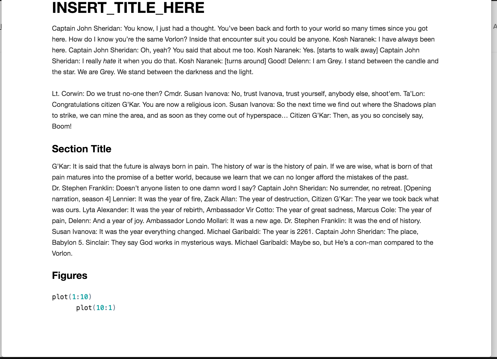

---
output:
  html_document:
    keep_md: true
  md_document:
    variant: markdown_github
---
A package of R markdown templates.

These are a set of alternate R markdown templates that do not use Bootstrap and do not include or rely on jQuery. These are primarily here for demonstration purposes but are also useful in and of themselves (it's always good to have choices). If you have a particular framework you like and it's not here, file an issue and I'll add it.

- **bulma** (`output: markdowntemplates::bulma`) uses the [Bulma CSS framework](http://bulma.io) and has optional `navtitle` and `navlink` YAML header elements and also has support for a subset of OpenGraph tags (see the example Rmd) which will be used in header of the generated file.
- **skeleton** (`output: markdowntemplates::skeleton`) or **default** (`output: markdowntemplates::default`) uses the [Skeleton CSS framework](http://getskeleton.com) and also has optional `navtitle` and `navlink` YAML header elements which will be used in header of the generated file.
- **kube** (`output: markdowntemplates::kube`) uses the [Kube CSS framework](https://imperavi.com/kube/) (contributed by Kieran Healy)
- **minimal** (`output: markdowntemplates::minimal`) uses no CSS framework and only uses the `title` YAML header element.

When you use RStudio to create a new R Markdown document, select "From Template" and choose one of these templates.

### Releases

- 0.3.0.9000 Kube framework contributed by Kieran Healy; preview images in help pages
- 0.2.1.9000 arbitrary footer content can be specified in the YAML header
- 0.2.0.9000 `self_contained=FALSE` now copies the custom CSS
- 0.1.0.9000 Initial release

### Bulma example

### Skeleton/default example

### Kube example

### Minimal example

